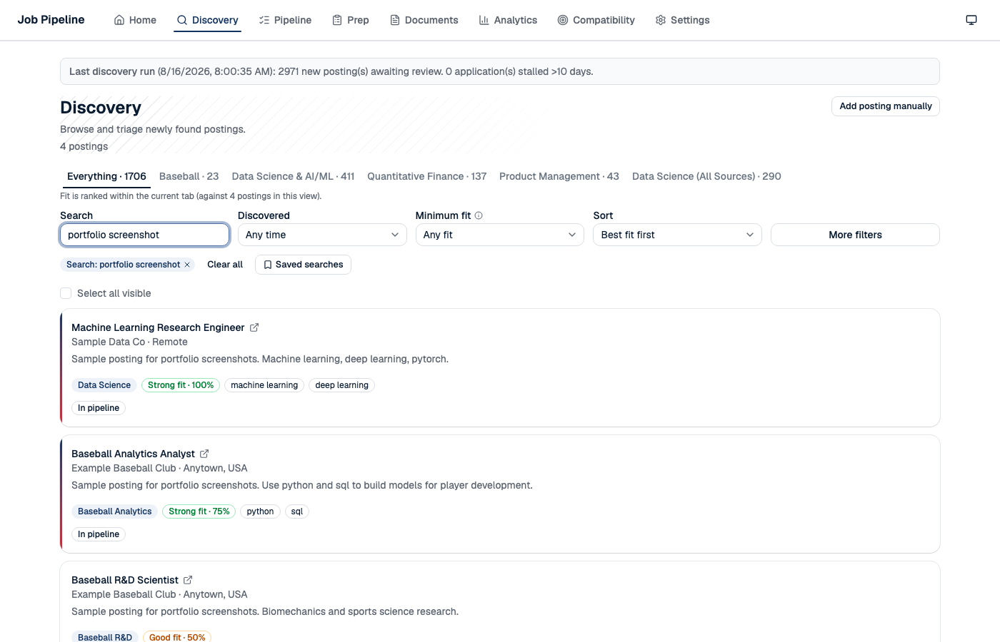
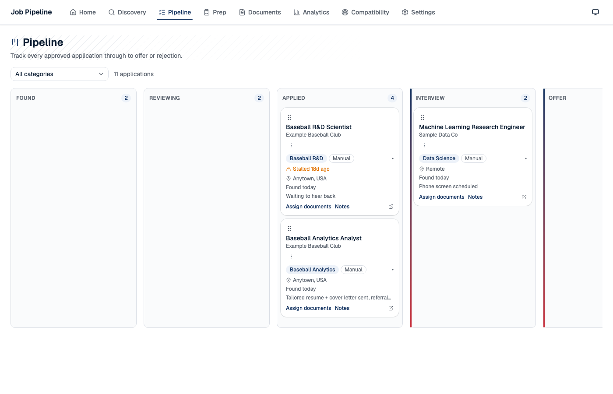
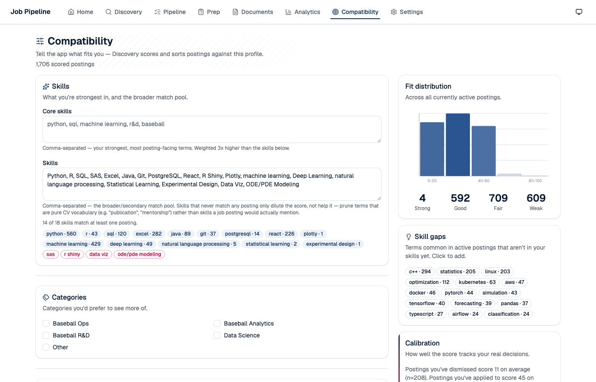
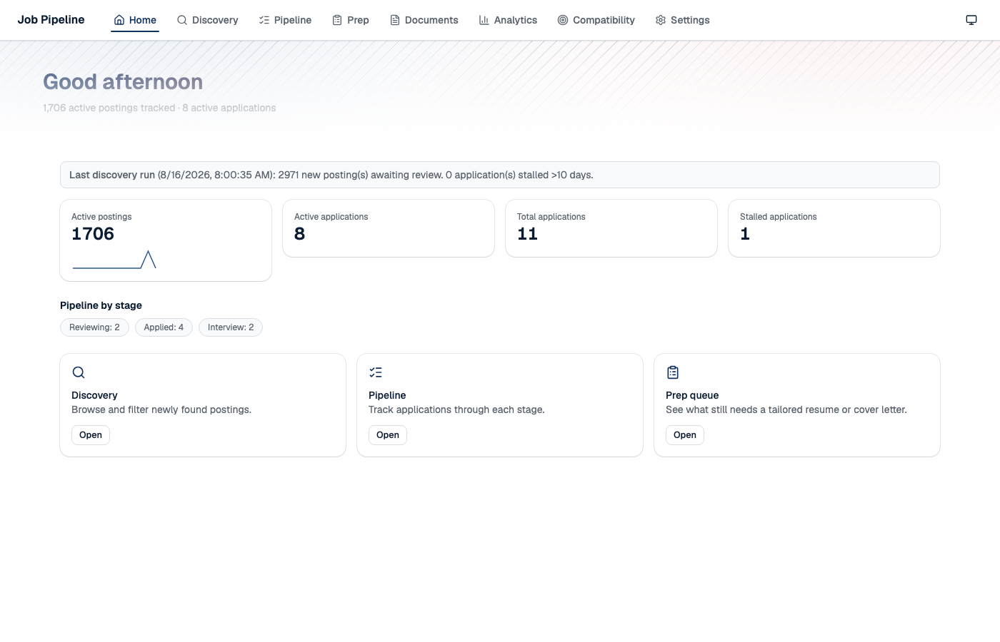

# MLBJobAutomation


A personal, local-first job search automation system for tracking and applying to baseball
operations / analytics / R&D roles and general data science jobs. Built and actively used for my
own search — every design decision below came out of a real problem it hit, not a spec.

Everything runs on my own machine — SQLite database, a local Express API, and a React UI. Nothing
is deployed anywhere, and no application is ever submitted automatically: the system surfaces
postings and drafts, and I always review and submit applications myself.

> Screenshots below use seeded demo data ("Example Baseball Club", "Sample Data Co") — no real
> company names or personal application history are shown.

## What it does

**Discovers postings** by scraping team/company career pages directly via each org's own job
board API (Greenhouse, Lever, Workday, ADP, UKG, BambooHR, and eight other platforms) rather than
scraping aggregator sites — covers all 30 MLB teams plus a curated set of non-MLB quant/data-science
employers. New sources are config-driven, not new adapter code, and every one is curl-verified
against the real API before being added.



**Scores every posting** against a candidate profile with a deterministic formula (role-signal
regex tiers, weighted skill matching, location boost, exclude-keyword penalty) blended with one ML
signal: cosine similarity against a **locally-run embedding model** (Ollama), never a paid API.
Personalized further by a highest-education-level penalty, so a posting that wants a PhD you don't
have scores lower — not just filtered.

**Tracks a pipeline** through a Kanban board, with cross-source duplicate detection (exact key +
fuzzy title matching, since the same role often gets posted to two different ATS platforms under
different wording), automatic closed/reopened posting tracking, and follow-up nudges when an
application has gone silent for 14+ days — computed from real stage-change history, not a
last-write timestamp that resets every time you edit a note.



**Tells you what you're missing.** Compatibility scores your skill coverage against the live
posting pool and surfaces terms that show up a lot in postings but aren't in your profile yet — a
concrete "add this to your resume" signal, one click to add it.



**Assists with prep, never submission.** It surfaces application backlogs, joins posting +
resume/cover-letter context for drafting, and includes an opt-in helper that visibly fills an
application form's fields for review — architecturally barred from ever calling `.submit()`, a
guardrail enforced by a literal string-match test so a future refactor can't quietly reintroduce it.



## Stack

- `job-app-system/api/` — Express + Prisma/SQLite, local embeddings via Ollama
- `job-app-system/scrapers/` — 13 source adapters + a daily discovery scheduler
- `job-app-system/ui/` — React (Vite) + Tailwind, Base UI components

## Running locally

```bash
cd job-app-system && npm run dev
```

Boots the API and UI together.

## How it was built

[`CLAUDE.md`](CLAUDE.md) is the project's running build log — every real bug caught, every design
tradeoff and why, kept current as the system evolved through AI-assisted development sessions. It's
less a spec and more a case study in reviewing AI-written code critically: a mis-scoped Prisma
`where` clause that silently clobbered a filter, a library API assumption that shipped a real bug
before being caught by clicking through the UI, a scoring formula tuned and re-tuned against real
observed data rather than accepted on the first pass. Worth a skim if you're curious what that
collaboration actually looks like in practice, not just the polished result.

See it too: [`docs/scraping-platform-history.md`](docs/scraping-platform-history.md) — the
platform-by-platform verification history behind "all 30 MLB teams," including two "this site is
blocked" conclusions that turned out to be wrong on closer inspection.
